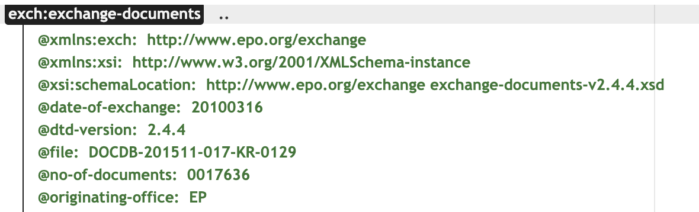
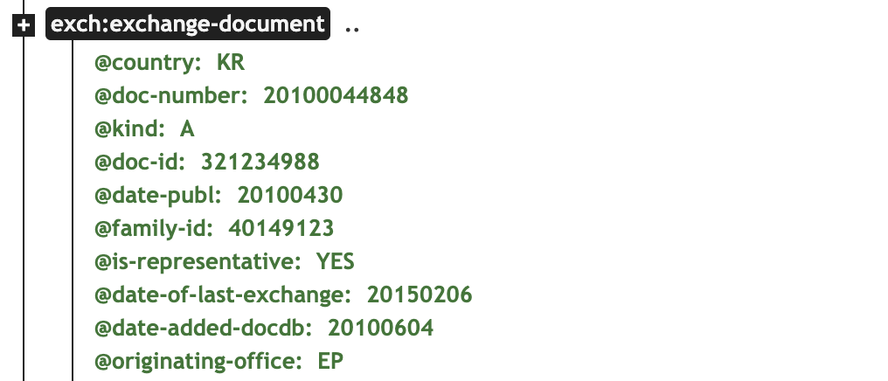
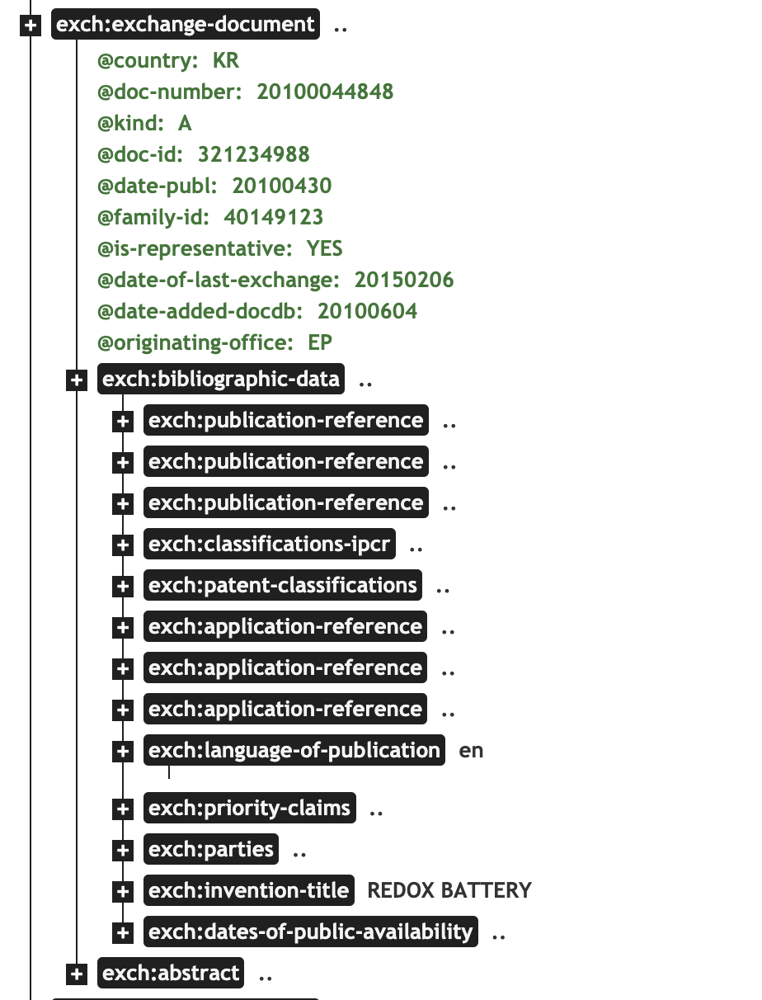
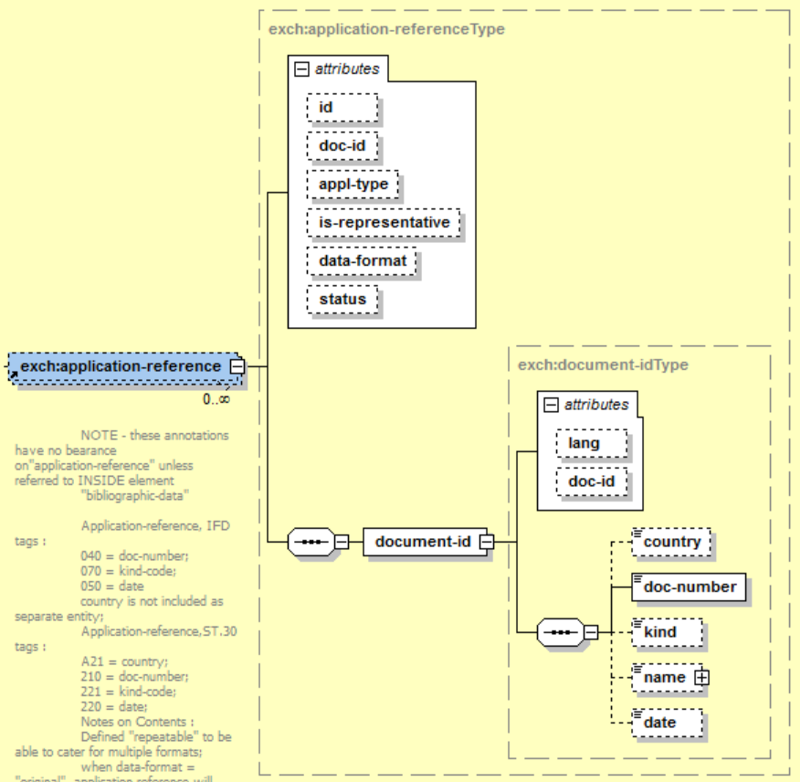
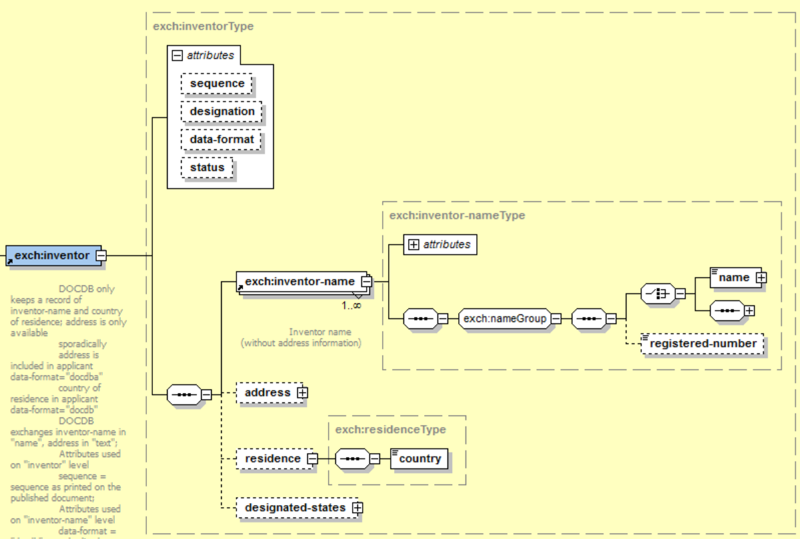

学术数据仓库的XML解析

[TOC]

## 1.	XML简介
XML 被设计用来传输和存储数据。
HTML 被设计用来显示数据。
提示：XML 是可扩展标记语言，HTML 为超文本标记语言。

---

* **XML 和 HTML 之间的差异**

    1. XML 不是 HTML 的替代。
    2. XML 和 HTML 为不同的目的而设计：
    3. XML 被设计用来传输和存储数据，其焦点是数据的内容。
    4. HTML 被设计用来显示数据，其焦点是数据的外观。
    5. HTML 旨在显示信息，而 XML 旨在传输信息。


## 2. XML树结构

XML 文档形成了一种树结构，它从"根部"开始，然后扩展到"枝叶"。

树结构是通常被称为 XML 树，并且可以很容易地描述任何 XML 文档。
通过采用树状结构，你可以知道所有从根开始的后续的分行及支行。

---

一个 XML 文档实例
XML 文档使用简单的具有自我描述性的语法：

```XML
<?xml version="1.0" encoding="ISO-8859-1"?>
<note>
<to>Tove</to>
<from>Jani</from>
<heading>Reminder</heading>
<body>Don't forget me this weekend!</body>
</note>
```

第一行是 XML 声明。它定义 XML 的版本（1.0）和所使用的编码（ISO-8859-1 = Latin-1/西欧字符集）。

下一行描述文档的根元素（像在说："本文档是一个便签"）：

```XML
<note>
```
接下来 4 行描述根的 4 个子元素（to, from, heading 以及 body）：
```XML
<to>Tove</to>
<from>Jani</from>
<heading>Reminder</heading>
<body>Don't forget me this weekend!</body>
```
最后一行定义根元素的结尾：
```XML
</note>
```
您可以假设，从这个实例中，XML 文档包含了一张 Jani 写给 Tove 的便签。

XML 文档形成一种树结构

XML 文档必须包含根元素。该元素是所有其他元素的父元素。

XML 文档中的元素形成了一棵文档树。这棵树从根部开始，并扩展到树的最底端。

所有的元素都可以有子元素：

```XML
<root>
<child>
<subchild>.....</subchild>
</child>
</root>
```

父、子以及同胞等术语用于描述元素之间的关系。父元素拥有子元素。相同层级上的子元素成为同胞（兄弟或姐妹）。

所有的元素都可以有文本内容和属性（类似 HTML 中）。


上图表示下面的 XML 中的一本书：

```XML
<bookstore>
<book category="COOKING">
<title lang="en">Everyday Italian</title>
<author>Giada De Laurentiis</author>
<year>2005</year>
<price>30.00</price>
</book>
<book category="CHILDREN">
<title lang="en">Harry Potter</title>
<author>J K. Rowling</author>
<year>2005</year>
<price>29.99</price>
</book>
<book category="WEB">
<title lang="en">Learning XML</title>
<author>Erik T. Ray</author>
<year>2003</year>
<price>39.95</price>
</book>
</bookstore>
```

实例中的根元素是 <bookstore>。文档中的所有 <book> 元素都被包含在 <bookstore> 中。

<book> 元素有 4 个子元素：<title>、<author>、<year>、<price>。

## 3. XPATH简介
XPath 是一门在 XML 文档中查找信息的语言。


### 节点

在 XPath 中，有七种类型的节点：**元素、属性、文本、命名空间、处理指令、注释以及文档（根）节点**。XML 文档是被作为节点树来对待的。树的根被称为文档节点或者根节点。

请看下面这个 XML 文档：

```XML
 <?xml version="1.0" encoding="ISO-8859-1"?>
 <bookstore>
  <book>
     <title lang="en">Harry Potter</title>
     <author>J K. Rowling</author>
     <year>2005</year>
     <price>29.99</price>
   </book>
</bookstore> 
```

上面的XML文档中的节点例子：

```XML
 <bookstore> (文档节点)

 <author>J K. Rowling</author> (元素节点)

 lang="en" (属性节点) 
```

基本值（或称原子值，Atomic value）
基本值是无父或无子的节点。

基本值的例子：

```XML
 J K. Rowling

 "en" 
```
### 节点关系

**父（Parent）**
每个元素以及属性都有一个父。

在下面的例子中，book 元素是 title、author、year 以及 price 元素的父：

```XML
<book>
   <title>Harry Potter</title>
   <author>J K. Rowling</author>
   <year>2005</year>
   <price>29.99</price>
 </book> 
```

**子（Children）**
元素节点可有零个、一个或多个子。

在下面的例子中，title、author、year 以及 price 元素都是 book 元素的子：

```XML
 <book>
   <title>Harry Potter</title>
   <author>J K. Rowling</author>
   <year>2005</year>
   <price>29.99</price>
 </book> 
```

**同胞（Sibling）**
拥有相同的父的节点

在下面的例子中，title、author、year 以及 price 元素都是同胞：

```XML
 <book>
   <title>Harry Potter</title>
   <author>J K. Rowling</author>
   <year>2005</year>
   <price>29.99</price>
 </book> 
```

**先辈（Ancestor）**
某节点的父、父的父，等等。

在下面的例子中，title 元素的先辈是 book 元素和 bookstore 元素：

```XML
 <bookstore>

 <book>
   <title>Harry Potter</title>
   <author>J K. Rowling</author>
   <year>2005</year>
   <price>29.99</price>
 </book>

 </bookstore> 
```

**后代（Descendant）**
某个节点的子，子的子，等等。

在下面的例子中，bookstore 的后代是 book、title、author、year 以及 price 元素：

```XML
 <bookstore>

 <book>
   <title>Harry Potter</title>
   <author>J K. Rowling</author>
   <year>2005</year>
   <price>29.99</price>
 </book>

 </bookstore> 
```

## 4. XPATH语法

XPath 使用路径表达式来选取 XML 文档中的节点或节点集。节点是通过沿着路径 (path) 或者步 (steps) 来选取的。

XML 实例文档
我们将在下面的例子中使用这个 XML 文档。

```XML
<?xml version="1.0" encoding="ISO-8859-1"?>

 <bookstore>

 <book>
   <title lang="eng">Harry Potter</title>
   <price>29.99</price>
 </book>

 <book>
   <title lang="eng">Learning XML</title>
   <price>39.95</price>
 </book>

 </bookstore> 
```

### 选取节点
XPath 使用路径表达式在 XML 文档中选取节点。节点是通过沿着路径或者 step 来选取的。 下面列出了最有用的路径表达式：


| 表达式  |描述  |
| --- | --- |
| nodename | 选取此节点的所有子节点。 |
| / | 从根节点选取。 |
| // | 从匹配选择的当前节点选择文档中的节点，而不考虑它们的位置。 |
| . | 	选取当前节点。 |
| .. | 选取当前节点的父节点。 |
| @ | 选取属性。 |


在下面的表格中，我们已列出了一些路径表达式以及表达式的结果：

|  路径表达式 | 结果 |
| --- | --- |
| bookstore | 选取根元素 bookstore。注释：假如路径起始于正斜杠( / )，则此路径始终代表到某元素的绝对路径！ |
| bookstore/book | 	选取属于 bookstore 的子元素的所有 book 元素。 |
| //book | 选取所有 book 子元素，而不管它们在文档中的位置。 |
| bookstore//book | 选择属于 bookstore 元素的后代的所有 book 元素，而不管它们位于 bookstore 之下的什么位置。 |
| //@lang | 选取名为 lang 的所有属性。 |

**提示：**如果 XPath 的开头是一个斜线（/）代表这是绝对路径。如果开头是两个斜线（//）表示文件中所有符合模式的元素都会被选出来，即使是处于树中不同的层级也会被选出来。

### **谓语（Predicates）**
谓语用来查找某个特定的节点或者包含某个指定的值的节点。

谓语被嵌在**方括号**中。

在下面的表格中，我们列出了带有谓语的一些路径表达式，以及表达式的结果：


| 路径表达式 | 结果 |
| --- | --- |
| /bookstore/book[1] |  选取属于 bookstore 子元素的第一个 book 元素。|
| /bookstore/book[last()] | 选取属于 bookstore 子元素的最后一个 book 元素。 |
|/bookstore/book[last()-1]  | 选取属于 bookstore 子元素的倒数第二个 book 元素。 |
|/bookstore/book[position()<3]  | 选取最前面的两个属于 bookstore 元素的子元素的 book 元素。 |
| //title[@lang] | 选取所有拥有名为 lang 的属性的 title 元素。 |
| //title[@lang='eng'] | 选取所有 title 元素，且这些元素拥有值为 eng 的 lang 属性。 |
| /bookstore/book[price>35.00] | 选取 bookstore 元素的所有 book 元素，且其中的 price 元素的值须大于 35.00。 |
|/bookstore/book[price>35.00]/title|选取 bookstore 元素中的 book 元素的所有 title 元素，且其中的 price 元素的值须大于 35.00。 |


### **选取未知节点**

XPath 通配符可用来选取未知的 XML 元素。


| 通配符 | 描述 |
| --- | --- |
| * | 匹配任何元素节点。 |
| @* | 匹配任何属性节点。 |
| node()  | 匹配任何类型的节点。 |

在下面的表格中，我们列出了一些路径表达式，以及这些表达式的结果：


| 路径表达式 | 结果 |
| --- | --- |
| /bookstore/* | 选取 bookstore 元素的所有子元素。 |
|  //*  | 选取文档中的所有元素。 |
| //title[@*]  |选取所有带有属性的 title 元素。 |

## 5.学术数据仓库的结构

### 5.1 专利数据集的XML声明

```XML
<?xml version="1.0" encoding="UTF-8" standalone="no"?>
    <exch:exchange-documents xmlns:exch="http://www.epo.org/exchange" xmlns:xsi="http://www.w3.org/2001/XMLSchema-instance" xsi:schemaLocation="http://www.epo.org/exchange exchange-documents-v2.4.4.xsd" date-of-exchange="20100316" dtd-version="2.4.4" file="DOCDB-201511-017-KR-0129" no-of-documents="0017636" originating-office="EP">
```

该文件声明：
采用的是1.0XML版本；
编码是UTF-8；
dtd-version 是2.4.4
交换文件命名采用“http://www.epo.org/exchange”
http://www.epo.org/exchange exchange-documents-v2.4.4.xsd 

可更容易地描述允许的文档内容
可更容易地验证数据的正确性
可更容易地与来自数据库的数据一并工作
可更容易地定义数据约束（data facets）
可更容易地定义数据模型（或称数据格式）
可更容易地在不同的数据类型间转换数据




###  5.2  单个专利文档的属性
```XML
<exch:exchange-document country="KR" doc-number="20100044848" kind="A" doc-id="321234988" date-publ="20100430" family-id="40149123" is-representative="YES" date-of-last-exchange="20150206" date-added-docdb="20100604" originating-office="EP">
```


### 5.3  单个专利文档的结构



可见专利文档的结构可以分为以下几层：
第一层: <exch:exchange-documents>
第二层: <exch:exchange-document>
第三层: <exch:bibliographic-data>和<exch:abstract>
第四层: <exch:publication-reference>和<exch:application-reference>等
第五层: 很多
第六层: 很多
第七层: 很多

### 5.4  申请节点为例

DOCDB中专利申请信息原始框架：

      

申请(段落)

```XML
<application-reference is-representative="YES" doc-id="11607218" dataformat="docdb">
<document-id>
<country>DE</country>
<doc-number>8909720</doc-number>
<kind>U</kind>
<date>19890812</date>
</document-id>
</application-reference>
```
***
#### 5.4.1 专利申请唯一标识符
**名称：** 专利申请唯一标识符
**中文别名：** 
**英文全称：** Application identification
**英文简称：** 
**描述：** 在专利整合过程中，针对不同来源的相同专利，或者同一件专利的多次公开/公布记录，赋予的虚拟标识，一般为不超过10位的数字。
**取值范围：** 1~900000000
**默认值：** 无
**数据来源：** DOCDB
***
```XML
<application-reference is-representative="YES" doc-id="11607218" dataformat="docdb">
<!--<document-id>
<country>DE</country>
<doc-number>8909720</doc-number>
<kind>U</kind>
<date>19890812</date>
</document-id>
</application-reference>-->
```
***
#### 5.4.2 专利申请号码
**名称：** 专利申请标识符
**中文别名：** 专利申请号码
**英文全称：** Application identification
**英文简称：** 
**描述：** 专利申请人提交专利文件后，专利受理局给予被受理的专利申请的顺序编号
**取值范围：** 至多17字符，包括国家/地区/组织结构代码以及申请顺序编号（一般为数字），不包括计算机校验位。
**默认值：** 无
**数据来源：** DOCDB
```xml
<!--<application-reference data-format="docdb" is-representative="N">
<document-id>
<country>DE</country>-->
<doc-number>10331291</doc-number>
<!--<kind>A</kind>
<date>20030710</date>
</document-id>
</application-reference>-->
```
**备注：** 极少量专利申请标识符的最后一位为A、D、T、X，表示该申请号码是作为虚拟申请号码，以替代真正申请号码缺失的专利：
•	A：数据有误
•	D：虚拟申请；D的前面是公开号码
•	T：虚拟技术优先权
•	X：1970年之前衍生的虚拟优先权
***
#### 5.4.3 专利申请日期
**名称：** 专利申请标识符
**中文别名：** 专利申请号码
**英文全称：** Application identification
**英文简称：** 
**描述：** 专利申请人提交专利文件后，专利受理局给予被受理的专利申请的顺序编号
**取值范围：** 至多17字符，包括国家/地区/组织结构代码以及申请顺序编号（一般为数字），不包括计算机校验位。
**默认值：** 无
**数据来源：** DOCDB

```xml
<!--<application-reference data-format="docdb" is-representative="N">
<document-id>
<country>DE</country>
<doc-number>10331291</doc-number>
<kind>A</kind>-->
<date>20030710</date>
<!--</document-id>
</application-reference>-->
```
***
#### 5.4.4 专利申请国家/地区
**名称：** 专利申请国家/地区
**中文别名：** 
**英文全称：** Application identification
**英文简称：** 
**描述：** 对于专利申请国家/地区的描述。
**取值范围：** 两位大写英文字符（A-Z），符合WIPO ST.3《用双字母代码表示国家、其他实体及政府间组织的推荐标准》。
**默认值：** 无
**数据来源：** DOCDB

```xml
<!--<application-reference data-format="docdb" is-representative="N">
<document-id>-->
<country>DE</country>
<!--<doc-number>10331291</doc-number>
<kind>A</kind>
<date>20030710</date>
</document-id>
</application-reference>-->
```
***
#### 5.4.5 专利申请类型代码
**名称：** 专利申请类型代码
**中文别名：** 
**英文全称：** Application identification
**英文简称：** 
**描述：** 对于专利申请类型的描述。
**取值范围：** 不超过两位字符，如A，U，D，D2，T，W等，其中
* A：发明专利
* U：实用新型
* F：外观设计
* P：临时专利申请
* W：处于国际阶段的PCT专利申请
* T：经过文本翻译后进入国家阶段的PCT专利申请或欧洲专利申请
* D2，D3：虚拟专利申请号码
* D，K，L，M，N：与其它专利申请号码相同但正确性有待核实的专利。

**默认值：** 无
**数据来源：** DOCDB

```xml
<!--<application-reference data-format="docdb" is-representative="N">
<document-id>
<country>DE</country>
<doc-number>10331291</doc-number>-->
<kind>A</kind>
<!--<date>20030710</date>
</document-id>
</application-reference>-->
```
**备注：** 对于PCT专利，APP_AUTH的取值为专利申请文件受理局所在的国家/地区代码，并非是WO。
***
#### 5.4.5 原始专利申请号码
**名称：** 原始专利申请号码
**中文别名：** 
**英文全称：** Application identification
**英文简称：** 
**描述：** 对于原始申请号码的描述。
**取值范围：** 格式并无规律，位数也不固定，总体上是由数字或字母的字符串组成。
**默认值：** 无
**数据来源：** DOCDB

```xml
<exch:application-reference data-format="original">
<document-id>
<doc-number>11137814</doc-number>
</document-id>
</exch:application-reference>
```
***

### 5.5  申请节点多个节点 
```XML
<exch:application-reference is-representative="NO" doc-id="315793632" data-format="docdb">
                    <document-id>
                        <country>KR</country>
                        <doc-number>20107003249</doc-number>
                        <kind>A</kind>
                        <date>20080716</date>
                    </document-id>
 </exch:application-reference>
 <exch:application-reference data-format="epodoc">
                    <document-id>
                        <doc-number>KR20107003249</doc-number>
                    </document-id>
</exch:application-reference>
<exch:application-reference data-format="original">
                    <document-id>
                        <doc-number>1020107003249</doc-number>
                    </document-id>
</exch:application-reference>
```

解析路径：
```XML
//exch:bibliographic-data/exch:application-reference[@data-format="docdb"]/document-id/doc-number
```

### 5.6  数组类型XML解析
```XML
<exch:classifications-ipcr>
<classification-ipcr sequence="1">
<text>C07K   7/08        20060101AFI20100427BHKR        </text>
</classification-ipcr>
<classification-ipcr sequence="2">
<text>A61K  38/00        20060101ALI20100427BHKR        </text>
</classification-ipcr>
<classification-ipcr sequence="3">
<text>A61P  31/00        20060101ALI20100427BHKR        </text>
</classification-ipcr>
</exch:classifications-ipcr>
```
```XML
//exch:classifications-ipcr/classification-ipcr/text
```
可以选择多Multiple Rows

### 5.7  嵌套类型XML解析




```xml
<exch:inventors>
<exch:inventor sequence="1" data-format="docdb">
       <exch:inventor-name>
         <name>MACDONALD ALEX BRUCE</name>
       </exch:inventor-name>
       <residence>
         <country>US</country>
       </residence>
</exch:inventor>
<exch:inventor sequence="2" data-format="docdb">
       <exch:inventor-name>
         <name>AN LING LING</name>
       </exch:inventor-name>
       <residence>
         <country>US</country>
       </residence>
</exch:inventor>
<exch:inventor sequence="1" data-format="docdba">
       <exch:inventor-name>
           <name>WHITTUM- HUDSON, JUDITH A</name>
</exch:inventor-name>
</exch:inventor>
<exch:inventor sequence="2" data-format="docdba">
       <exch:inventor-name>
         <name>MACDONALD,ALEX BRUCE,</name>
</exch:inventor-name>
</exch:inventor>
<exch:inventor sequence="3" data-format="docdba">
       <exch:inventor-name>
         <name>AN, LING LING</name>
       </exch:inventor-name>
   </exch:inventor>
 </exch:inventors>
```

### 5.8  XML解析思路
单一取值、单一属性直接提取
数组类型提取多次
嵌套类型提取组合再分解。
